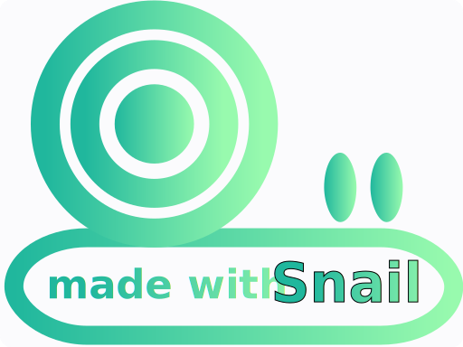

</img>
# Snail
A small SVG library for simple graphics rendering and experiments.

## Example
Code below demonstrates how to draw the Snail logo:

```C
#include "snail/snail.h"

void draw_logo(void) {
    // create canvas
    snl_canvas_t canvas = snl_canvas_create(512, 384);
    snl_canvas_preallocate(&canvas, 2048);

    // add filters and gradients
    snl_canvas_add_gradient_linear(
        &canvas, "lg0", 
        SNL_COLOR(32, 183, 157, 255), SNL_COLOR(152, 250, 174, 255), 
        0, 100, 100, 100, 0 // offsetA, offsetB, opacityA, opacityB, angle
    );

    // background
    snl_canvas_render_rectangle(
        &canvas, 
        SNL_POINT(0, 0), SNL_POINT(canvas.width, canvas.height),
        13, SNL_APPEARANCE(0, 1, SNL_COLOR_NONE, 1, SNL_COLOR_PALEWHITE, NULL, NULL)
    );

    // circles: snail shell
    const float circle_radius[3] = { 2.5*canvas.height/7, 1.8*canvas.height/7, 0.9*canvas.height/7 };
    for (size_t i = 0; i < 3; i++) {
        snl_canvas_render_circle(
            &canvas, SNL_POINT(canvas.width/3, 2.5*canvas.height/7), circle_radius[i], 
            SNL_APPEARANCE(i ? 21 : 0, 1, i ? SNL_COLOR_WHITE : SNL_COLOR_BLACK, 1, SNL_COLOR_NONE, NULL, i ? NULL : "lg0")
        );
    }

    // snail body outer (green with gradient)
    snl_canvas_render_rectangle(
        &canvas, 
        SNL_POINT(0, 2*canvas.height/3), SNL_POINT(canvas.width, canvas.height/3.2),
        81, SNL_APPEARANCE(0, 1, SNL_COLOR_NONE, 1, SNL_COLOR_NONE, NULL, "lg0")
    );

    // snail body inner (white)
    snl_canvas_render_rectangle(
        &canvas, 
        SNL_POINT(canvas.width*0.05, 2.15*canvas.height/3), SNL_POINT(canvas.width*0.9, 0.67*canvas.height/3.2),
        45, SNL_APPEARANCE(0, 1, SNL_COLOR_NONE, 1, SNL_COLOR_WHITE, NULL, NULL)
    );

    // left eye
    snl_canvas_render_rectangle(
        &canvas, 
        SNL_POINT(3.5*canvas.width/5, 1.38*canvas.height/3), SNL_POINT(0.07*canvas.width, 0.2*canvas.height),
        81, SNL_APPEARANCE(0, 1, SNL_COLOR_NONE, 1, SNL_COLOR_NONE, NULL, "lg0")
    );

    // right eye
    snl_canvas_render_rectangle(
        &canvas, 
        SNL_POINT(4*canvas.width/5, 1.38*canvas.height/3), SNL_POINT(0.07*canvas.width, 0.2*canvas.height),
        81, SNL_APPEARANCE(0, 1, SNL_COLOR_NONE, 1, SNL_COLOR_NONE, NULL, "lg0")
    );

    // text: made with
    snl_canvas_render_text3(
        &canvas,
        SNL_POINT(0.1*canvas.width, 4.3*canvas.height/5), 
        "made with", SNL_APPEARANCE(0, 1, SNL_COLOR_NONE, 1, SNL_COLOR_NONE, NULL, "lg0"),
        SNL_TEXT_DECORATION(45, 0, SNL_FONT_GILL_SANS, SNL_FONT_WEIGHT_BOLD, SNL_FONT_STYLE_ITALIC, SNL_TEXT_NONE)
    );

    // text: snail
    snl_canvas_render_text3(
        &canvas,
        SNL_POINT(1.17*canvas.width/2, 4.35*canvas.height/5), 
        "Snail", SNL_APPEARANCE(1, 1, SNL_COLOR_BLACK, 1, SNL_COLOR_NONE, NULL, "lg0"),
        SNL_TEXT_DECORATION(60, 0, SNL_FONT_LUMINARI, SNL_FONT_WEIGHT_BOLD, SNL_FONT_STYLE_NORMAL, SNL_TEXT_NONE)
    );

    // save and destroy canvas
    snl_canvas_save(&canvas, "../imgs/logo.svg");
    snl_canvas_destroy(&canvas);
}
```

This produces the SVG below:



## Building the library
```
$ ./build.sh    # linux, macos
$ ./build.bat   # windows
```
You will find the static library inside the `lib/` folder.

## Usage
Create a new project and copy over the neccessary files:
```
|- my_project
    |- third_party
        |- vita  (from 'inc/' folder)
        |- snail (from 'inc/' folder)
    |- lib
        |- libvita.a
        |- libsnail.a
    |- main.c
```
Vita can be found [here](https://github.com/kirillsaidov/vita). Then, to build the project, execute:
```
$ gcc main.c -o main -Ithird_party -Llib -lsnail -lvita
$ ./main
```
Check out the test [Makefile](./tests/Makefile) for more details.

## LICENSE
All code is licensed under the BSL license.

